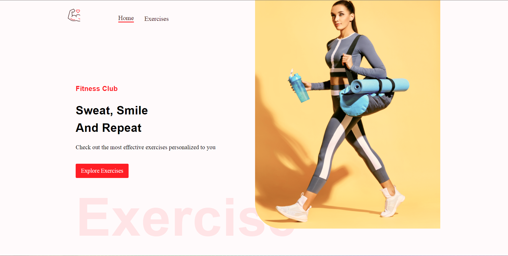
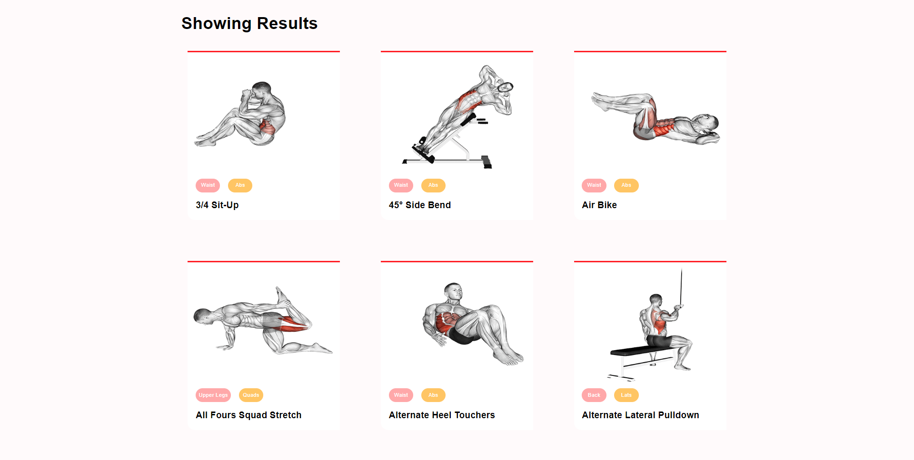
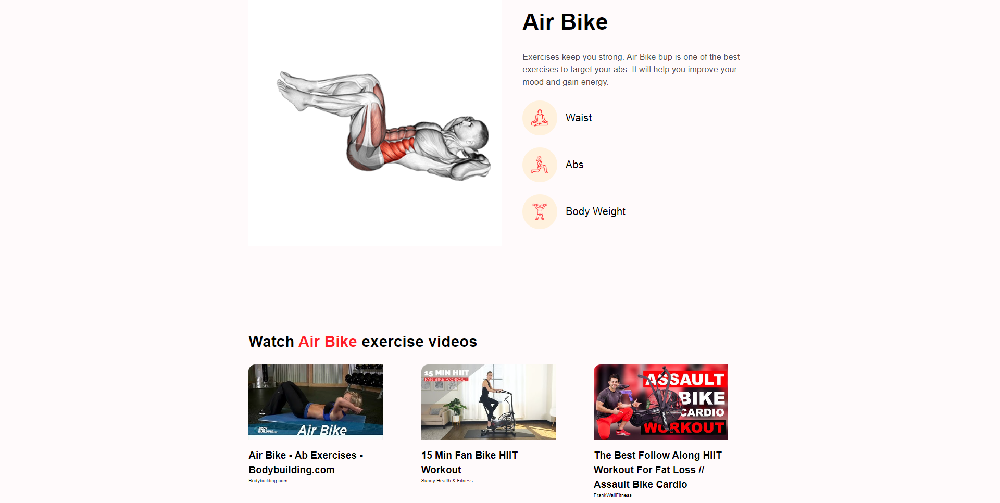

# Exercise Website

You can view this project [here](https://gym-exercise-react-app.netlify.app/).

## Built using:

Front end:

-  [React.js](https://reactjs.org/)
- [MUI / Material](https://mui.com/)
- [Rapid APIs](https://rapidapi.com)

Deployment:

* [Netlify](https://www.netlify.com)

## Setup

- run `npm i && npm start`

## Getting Started

In the project directory, you can run:

### `npm start`

Runs the app in the development mode.\
Open [http://localhost:3000](http://localhost:3000) to view it in your browser.

The page will reload when you make changes.\
You may also see any lint errors in the console.
